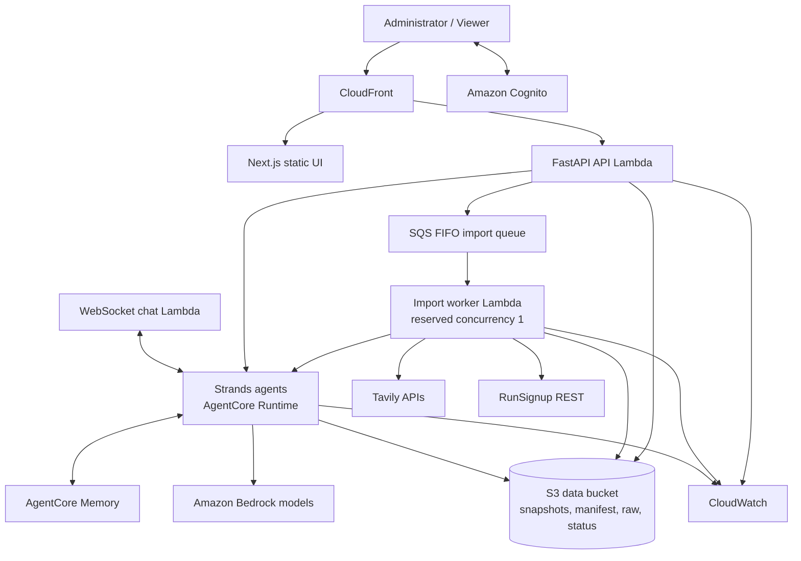
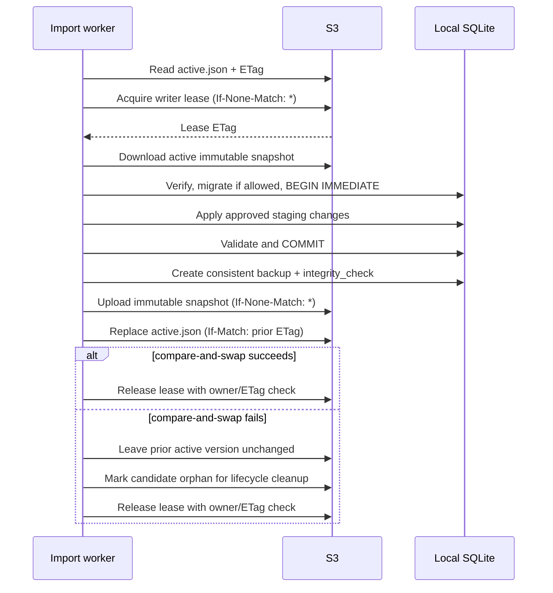
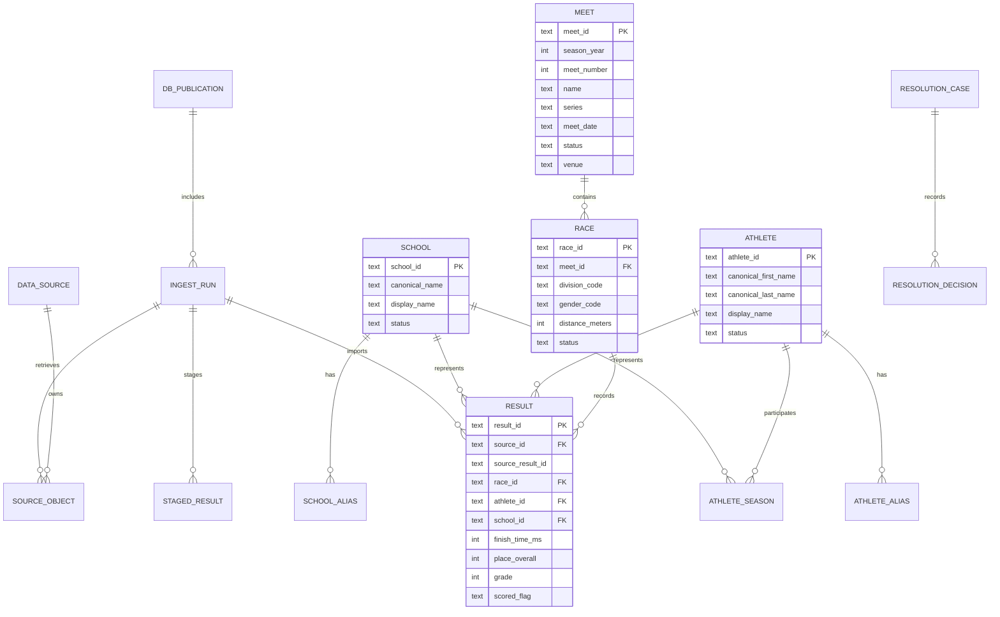

# XC Data Platform Modernization — Technical Design

**Status:** Approved September 19, 2026  
**Depends on:** [Approved requirements](requirements.md)  
**Last updated:** September 19, 2026

## 1. Executive summary

The platform will become a small, serverless, read-mostly AWS application centered on a normalized SQLite database. SQLite will run only from local ephemeral storage. Amazon S3 will hold immutable, checksummed database snapshots, raw-source artifacts, an active-version manifest, and operational status documents. A serialized import worker will be the only database writer; web APIs and agents will use verified read-only snapshots.

A submitted race URL will enter a RunSignup-family ingestion pipeline. RunSignup sources (including white-label mirrors) will use a structured REST adapter; Tavily Map/Crawl will discover related pages within that family. *(Amended 2026-09-21 by owner decision: Tavily Extract/Crawl fallback for non-RunSignup result sites is dropped from release 1 — Task 3.3 found no genuine non-RunSignup source producing usable rows. A non-RunSignup URL is refused, not extracted.)* Staged data will pass deterministic validation and identity matching before a Strands resolution agent examines only unresolved candidates. Ambiguous matches will require administrator approval.

The production UI will be a React/Next.js static-export application styled with Tailwind and shadcn/ui. It will render sanitized Markdown, TanStack data tables, and Vega-Lite charts. A Python FastAPI backend on AWS Lambda will expose versioned query and administration APIs. Cognito will provide invite-only authentication. Long-running imports will use a FIFO queue and a single-concurrency Lambda worker. Strands analytics and resolution agents will run in Amazon Bedrock AgentCore Runtime, subject to the feasibility gates, and will use AgentCore Memory only for conversational context and opted-in user preferences.

The architecture deliberately avoids RDS, EFS, NAT Gateway, an Application Load Balancer, and always-on compute. These choices suit a small, seasonal, read-mostly workload with no always-on components.

## 2. Design principles

1. **Source data before interpretation.** Preserve source IDs, original values, raw payload references, and extraction strategy.
2. **Deterministic before agentic.** Exact IDs, constraints, aliases, and normalization run before any model call.
3. **Humans decide ambiguity.** The agent proposes; confidence thresholds and the administrator determine whether a match is committed.
4. **One canonical write path.** All domain writes pass through one serialized import/publication worker.
5. **Immutable publication.** Readers consume complete database generations; no reader observes a partially updated database.
6. **Analytics are reproducible.** SQL views and versioned calculation modules own metrics; the LLM does not invent formulas.
7. **Agents are least-privilege clients.** Analytics agents receive read-only snapshots and bounded tools. Resolution agents return proposals, not writes.
8. **Useful without AI.** Approved dashboards and SQL analytics remain available when Tavily, Bedrock, or AgentCore is unavailable.
9. **Bounded operations.** Every external or model-driven operation has explicit limits and a non-agent fallback. *(Amended 2026-09-20: the cost framing was removed.)*
10. **Public results still deserve care.** Collect only fields required for race analytics and protect the application with invite-only access.

## 3. Key decisions

### 3.1 SQLite and S3

**Decision:** S3 is the durable publication and recovery store; a downloaded local file is the live SQLite database.

The design will not mount S3 and write SQLite through it. S3 objects are whole-object values, while SQLite needs filesystem locking and random writes. Instead, each database generation is immutable. A small JSON manifest identifies the approved generation. S3 conditional writes (`If-None-Match` and `If-Match`) provide compare-and-swap behavior for lock and manifest objects, and S3 Versioning protects prior manifests and snapshots. AWS documents that successful `PutObject` operations create complete objects and that conditional headers can prevent unintended overwrite ([S3 PutObject](https://docs.aws.amazon.com/AmazonS3/latest/API/API_PutObject.html), [conditional writes](https://docs.aws.amazon.com/AmazonS3/latest/userguide/conditional-writes.html)).

**Why not Litestream in release 1:** The writer is an on-demand Lambda that starts from the active snapshot, commits one bounded import, and publishes a new immutable snapshot. There is no long-lived local database process whose WAL needs continuous replication. Snapshot publication plus S3 Versioning is simpler and cheaper. Litestream remains an option if the architecture later moves to persistent single-instance compute.

### 3.2 Hybrid extraction *(amended 2026-09-21: "hybrid" now means REST-plus-discovery, not REST-plus-extraction-fallback — see below)*

**Decision:** Use a source adapter boundary. RunSignup REST is the only ingestion path in release 1; Tavily performs discovery only.

The REST adapter provides stable source IDs and structured fields. Tavily remains valuable for discovering related result pages within the RunSignup family — sibling races, years, and events a submitted URL doesn't itself reference. **Non-RunSignup extraction fallback is dropped from release 1** (owner decision, 2026-09-21): Task 3.3 found no genuine non-RunSignup source producing usable rows, so the design no longer asks an LLM-oriented extractor to serve as a general intake path for arbitrary sites. This separation also avoids asking that extractor to reconstruct RunSignup fields already available as JSON.

All RunSignup endpoints and response mappings are treated as adapter implementation details—not permanent domain contracts. The feasibility phase must verify access, pagination, coverage, terms, and historical behavior before production implementation.

### 3.3 Frontend

**Decision:** Next.js static export with React and TypeScript, Tailwind CSS, shadcn/ui, TanStack Query/Table, sanitized Markdown, and Vega-Lite.

A static export provides a polished component model without an always-on Node server. The authenticated backend serves protected HTML entry points and APIs; hashed static assets can be cached by CloudFront because they contain no user or race data. Vega-Lite is selected because agents can produce declarative JSON specifications that are schema-validatable and do not execute arbitrary code.

### 3.4 Backend and asynchronous work

**Decision:** FastAPI on Lambda for request/response APIs; SQS FIFO plus a reserved-concurrency-one Lambda worker for ingestion and database publication.

This keeps idle cost near zero. A single FIFO message group and worker concurrency of one are the first concurrency boundary; the S3 writer lease and manifest compare-and-swap are the correctness boundary.

### 3.5 Agent hosting and memory

**Decision:** Build runtime-neutral Strands agents, then package them for AgentCore direct code deployment if feasibility passes.

Current AgentCore documentation permits Python direct-code deployment through an AgentCore SDK entrypoint or the `/invocations` and `/ping` service contract. It supports Strands projects and Python 3.10+; native dependencies require compatible Linux/ARM builds ([AgentCore Python deployment](https://docs.aws.amazon.com/bedrock-agentcore/latest/devguide/runtime-get-started-code-deploy-python.html)). The initial agent package will therefore avoid pandas and other compiled dependencies where practical. If feasibility demonstrates a native dependency requirement, the agent will use a reproducible Linux/ARM build or container deployment.

AgentCore's Strands integration supports short-term sessions and configurable long-term strategies keyed by actor and session IDs ([Strands AgentCore Memory integration](https://docs.aws.amazon.com/bedrock-agentcore/latest/devguide/strands-sdk-memory.html)). Long-term memory will be limited to opted-in preferences and summaries. Identity decisions remain in SQLite.

### 3.6 Agent skills packaging

**Decision (amended 2026-09-20):** Ship the reusable guidance as repository-local skills under `.github/skills/`, and mirror repository-critical rules in ordinary `.kiro/` project configuration.

Originally this design specified five installable Kiro Power packages under `powers/`, each requiring a one-time per-user folder import. The owner converted them to repo-local `SKILL.md` packages that agentic assistants discover automatically, removing the manual import step entirely:

```text
.github/skills/
  xc-strands-typed-tools/          xc-strands-limits-portability/
  xc-strands-local-testing/        xc-agentcore-runtime-deployment/
  xc-agentcore-memory-identity/    xc-agentcore-observability/
  xc-tavily-source-routing/        xc-tavily-credit-content-safety/
  xc-domain-race-scoring/          xc-domain-entity-resolution/
  xc-domain-data-gaps/             xc-sqlite-s3-durability/
  xc-sqlite-s3-publication-protocol/
```

Each skill is a `SKILL.md` with frontmatter (`name`, `description` with activation cues) and bodies stating approved patterns, anti-patterns, security constraints, cost considerations, and authoritative documentation links. No secret appears in any skill. A repository-level `.kiro/steering/xc-platform.md` mirrors only the project invariants that must be active immediately after clone.

## 4. System context



### Trust boundaries

- The browser never receives AWS credentials, Tavily credentials, database snapshots, or raw source payloads.
- CloudFront/S3 static assets contain application code only.
- The API enforces authenticated roles on every operation.
- The import worker can read/write the data bucket and read Tavily configuration.
- The analytics AgentCore role can read approved snapshots but cannot publish them.
- The resolution agent receives bounded candidate packets and returns structured proposals; it has no database-write permission.
- External web content is untrusted data and cannot modify prompts, policies, or tool permissions.

## 5. Repository organization

```text
xc_data_analysis/
  src/xc_platform/
    api/                 # FastAPI routes, auth, response models
    db/                  # migrations, repositories, views, publication client
    ingest/
      adapters/          # RunSignup, Tavily, saved-file compatibility
      normalize/         # source-to-staging transforms
      pipeline.py
    resolution/          # candidates, deterministic rules, decisions
    analytics/           # approved metrics and scenario functions
    agents/              # runtime-neutral Strands definitions and tools
    security/            # URL policy, redaction, role checks
    observability/       # correlation and usage events
    cli/                 # migrations, backfill, parity, restore
  migrations/            # ordered SQLite SQL migrations
  web/                   # Next.js static-export application
  infrastructure/        # AWS CDK in TypeScript
  .github/skills/        # thirteen repo-local agent skill packages (converted from Powers)
  feasibility/           # reproducible probes and generated report
  tests/
    fixtures/            # redacted/approved source and baseline fixtures
    parity/
    contract/
    integration/
    security/
  data/                  # legacy sources retained during migration
```

The existing scripts remain unchanged until parity is established. Compatibility adapters may call or reuse their pure parsing logic during migration, but the new pipeline does not continue the sequential rewrite pattern.

## 6. AWS deployment topology

### 6.1 Regional services

- **S3 web bucket:** private Next.js output and hashed static assets; CloudFront-only access.
- **S3 data bucket:** private, versioned, encrypted snapshots, manifests, raw payloads, job-status documents, and feasibility artifacts.
- **CloudFront:** one user-facing origin, compression, TLS, security headers, asset caching, and API routing.
- **Cognito User Pool:** administrator-created users only; self-registration disabled; `admin` and `viewer` groups.
- **API Gateway HTTP API + API Lambda:** authenticated application and administration APIs.
- **API Gateway WebSocket API + chat Lambda:** streamed agent events. A short-lived signed connection ticket is issued by the authenticated HTTP API and supplied as a WebSocket subprotocol so credentials do not enter URL query strings.
- **SQS FIFO:** serial import queue using one message group for database-writing work.
- **Import worker Lambda:** reserved concurrency 1, bounded runtime, outbound HTTPS, S3 publication permissions.
- **AgentCore Runtime and Memory:** two logical agents (analytics and resolution) with separate policies and service roles, deployed at platform version V2 (section 12.6).
- **Bedrock:** model provider selected by feasibility measurements; lower-cost model is default and escalation is policy-controlled.
- **SSM Parameter Store SecureString:** Tavily key and application configuration that cannot be source-controlled. Exact service choice is rechecked against pricing during feasibility.
- **CloudWatch and SNS:** operational logs, metrics, and alerts. *(Amended 2026-09-20: AWS Budgets removed with the cost requirements.)*

No component is placed in a VPC for release 1. This avoids NAT Gateway cost and is acceptable because the platform uses public AWS service endpoints with IAM and TLS. A VPC is added only if a later private-resource requirement justifies its fixed cost.

### 6.2 Protected web shell

Hashed CSS/JavaScript assets contain no application data and may be publicly cacheable. HTML entry points, API routes, and WebSocket ticket issuance require a valid application session. The backend-for-frontend OAuth flow uses Cognito Authorization Code with PKCE and sets Secure, HttpOnly, SameSite cookies. The API still performs server-side role checks; hiding controls in React is never authorization.

If the selected API Gateway/CloudFront cookie integration cannot meet the auth criteria, the feasibility gate will compare a Lambda@Edge authentication handler with serving the protected static entry point from the API Lambda. No anonymous data API is permitted. *(Amended 2026-09-20: "cost criteria" removed with the cost requirements.)*

**Confirmed live (Task 3.7, 2026-09-21):** a bare `Authorization: Bearer <JWT>`
pattern validated only by API Gateway's stateless JWT authorizer does **not**
satisfy R13.7's revocation criterion. After `admin-user-global-sign-out`, a
still-unexpired access token was rejected by Cognito directly (`GetUser` →
"Access Token has been revoked") but still **accepted** by the JWT authorizer,
because it checks only signature/issuer/audience/expiry and never calls back
to Cognito. The BFF cookie session specified above — where the API checks a
server-side session record on every request — is therefore not just the
preferred approach but the only one of the two tested that can make a
revocation take effect immediately rather than at token expiry. See
[protected-api-evidence.md](../../../docs/protected-api-evidence.md).

## 7. SQLite publication design

### 7.1 S3 layout

```text
s3://<data-bucket>/
  database/
    active.json
    locks/writer.json
    snapshots/<publication-id>/xc.db
    reports/<publication-id>/reconciliation.json
  raw/<source>/<yyyy>/<sha256>.json.gz
  jobs/<ingest-run-id>/status.json
  feasibility/<run-id>/...
```

`active.json` contains:

```json
{
  "publication_id": "uuid",
  "parent_publication_id": "uuid-or-null",
  "snapshot_key": "database/snapshots/<id>/xc.db",
  "snapshot_version_id": "s3-version-id",
  "sha256": "hex-digest",
  "byte_size": 123456,
  "schema_version": 1,
  "created_at": "UTC timestamp",
  "created_by": "ingest-run-id",
  "summary": {
    "results": 0,
    "athletes": 0,
    "schools": 0,
    "meets": 0
  }
}
```

### 7.2 Reader algorithm

1. Fetch `active.json` and its ETag, with a short configurable cache TTL.
2. If the publication is already cached in `/tmp`, reuse it.
3. Otherwise download the immutable snapshot to a temporary filename.
4. Verify byte size, SHA-256, supported schema version, and `PRAGMA quick_check`. **The SHA-256 check is not redundant with the SQLite integrity check and must fail closed on its own** — confirmed live (Task 3.4): a snapshot with 64 bytes zeroed in its middle *passed* `PRAGMA integrity_check` (SQLite's b-tree structure was still well-formed) and was caught only by the digest mismatch. A file that fails the digest check is never opened, regardless of what SQLite reports about it.
5. Rename the file atomically within `/tmp` and open it with `mode=ro` and `immutable=1`.
6. Pin one publication ID for the duration of a request or agent conversation and include it in analytical provenance.
7. Retain the prior verified local file until in-flight requests finish.

A failed refresh does not evict the previous valid snapshot.

### 7.3 Writer algorithm



The lease contains owner ID, ingest-run ID, acquisition time, expiry, and heartbeat. A stale lease can be replaced only through an ETag-conditional write. FIFO serialization and reserved concurrency make contention unlikely; manifest compare-and-swap prevents lost updates even if a lease mechanism fails.

Before upload, the writer checkpoints local WAL state, creates a standalone consistent snapshot with SQLite's backup mechanism, runs `foreign_key_check` and `integrity_check`, and computes SHA-256. It uploads the new immutable key before changing the manifest. Therefore a crash at any earlier step cannot expose an incomplete generation.

### 7.4 Restore

Restore never edits an old snapshot. The administrator selects a verified historical generation; the restore operation validates it and publishes a **new** `active.json` version whose snapshot reference points to the selected immutable object and whose parent is the current publication. This preserves an append-only audit path.

## 8. Relational data model

All identifiers are UUID text. Timestamps are UTC ISO-8601 text. Durations use integer milliseconds and distances use integer meters to avoid binary floating-point drift.



### 8.1 Core tables

- `data_sources`: source namespace, adapter type, base domain, status.
- `source_objects`: immutable S3 raw-object reference, content hash, URL, retrieval metadata, media type, extraction strategy.
- `ingest_runs`: state, submitted URL, requested scope, adapter, counts, timestamps, costs, parent/publication IDs, errors.
- `staged_results`: source fields plus normalized candidate fields, validation state, source object, and idempotency key.
- `meets`: season, number, series, date, location, completeness/status.
- `races`: meet, division, gender category, source distance, result status.
- `schools` and `school_aliases`: canonical school identity and source-specific names.
- `athletes` and `athlete_aliases`: canonical public result identity and source-specific names.
- `athlete_seasons`: season-to-school/grade/division evidence; not assumed immutable because athletes can transfer.
- `results`: source and canonical identity links, original time strings, integer measurements, place, bib, grade, scored indicator.
- `source_entity_links`: maps upstream race/event/result-set IDs to canonical meet/race entities.
- `resolution_cases` and `resolution_decisions`: candidates, evidence, confidence, disposition, actor, model/policy version, and reversal links.
- `award_rules`: versioned Saint Sebastian participation and ranking configuration by season/series.
- `db_publications`: publication lineage, schema version, hash, S3 identifiers, counts, and status.
- `metric_versions`: formula name, semantic version, parameters, effective period, and implementation hash.

### 8.2 Important constraints and indexes

- Unique `(source_id, source_result_id)` when a source result ID exists.
- Unique `(source_id, source_entity_type, source_entity_id)` for source entity links.
- Unique normalized alias within `(source_id, alias_type, normalized_value, context_key)` unless marked ambiguous.
- Positive distance, time, and place constraints when values are present.
- One result per `(race_id, athlete_id)` unless a documented race format explicitly permits otherwise.
- Indexes on season/meet/race, athlete/date, school/race, source IDs, alias normalized values, resolution state, and ingest state.
- Foreign keys enabled on every connection.

### 8.3 Derived views

- `v_results_enriched`: distance in km/miles, pace per km/mile, speed, formatted times, source and metric versions.
- `v_team_scores`: rank runners by official place within race and school; sum first five; exclude teams with fewer than five.
- `v_saint_sebastian`: cumulative time, meetings completed, eligibility, rank, and time-back using versioned `award_rules` and meet completeness.
- `v_athlete_progression`: chronological results and comparable normalized metrics.
- `v_race_percentiles`: within-race and comparable-category percentile ranks.
- `v_data_completeness`: expected versus published result sets and athlete-level availability.

The source `scored` flag is preserved and used to validate the calculated top-five score, but the platform's versioned scoring rule remains authoritative unless the administrator explicitly selects source scoring.

## 9. Ingestion architecture

### 9.1 Adapter contract

```python
class SourceAdapter(Protocol):
    def can_handle(self, normalized_url: NormalizedUrl) -> bool: ...
    def discover(self, request: DiscoveryRequest) -> DiscoveryResult: ...
    def fetch(self, item: DiscoveredResultSet) -> FetchResult: ...
    def normalize(self, payload: FetchResult) -> list[StagedResultInput]: ...
```

Adapters cannot write canonical tables. They return immutable discovery/fetch results and normalized staging inputs.

### 9.2 Source router

1. Parse and canonicalize the URL without fetching it.
2. Require HTTPS, allow only supported ports, resolve DNS, and reject loopback, link-local, private, metadata-service, and reserved destinations.
3. Revalidate every redirect.
4. For RunSignup, extract race ID and recognize query/fragment result-set scope. **Rewrite fragment scope (`#resultSetId-N;perpage:M`) into query-string scope (`?resultSetId=N`) as part of normalization** — the fragment is never sent to the server, so a URL that still carries scope only in its fragment is not independently reproducible or extractable (Task 3.3 evidence: query-string scope reached 20/20 name recall from Tavily Extract; fragment-only scope reached 0/20 on the identical page).
5. Select `RunSignupAdapter`; optionally invoke Tavily discovery for sibling pages within configured scope. **Treat `trisignup.com` and `adventuresignup.com` as RunSignup-family hosts**, not distinct sources — they are white-label front ends serving the same numeric race IDs (confirmed live, Task 3.3). Routing them as a different source would ingest identical races twice under different provenance.
6. *(Amended 2026-09-21 by owner decision: non-RunSignup extraction fallback is dropped from release 1. A non-RunSignup, non-mirror domain is no longer routed to an extraction adapter — see step 7.)*
7. Reject unknown, disallowed, or non-RunSignup-family sources unless the administrator explicitly adds an allowlist policy for a specifically approved and measured source in a future release.

### 9.3 RunSignup adapter

The feasibility implementation will verify candidate public endpoints for:

- race and historical event metadata;
- event-specific result-set enumeration;
- paginated result retrieval;
- source field/header metadata.

The adapter maps response-specific custom field IDs by their accompanying header labels, never by assuming one numeric custom-field identifier is universal (confirmed live, Task 3.2: the same "Team Name" label appeared under 45 distinct numeric field IDs across the series). It preserves `result_id`, result-set ID, event ID, race ID, source distance, original result strings, and raw JSON.

**RunSignup reports errors as HTTP 200 with an `error` envelope in the body, not as an HTTP error status** (confirmed live, Task 3.2: invalid race IDs, unknown events, and missing parameters all returned 200). The adapter must inspect every response body for an `error` key regardless of status code; a retry policy keyed on status codes alone would retry a permanent error forever.

A bounded retry policy handles 429 and transient 5xx responses, and the `error`-envelope case above, with exponential backoff and jitter. Permanent 4xx responses and permanent `error`-envelope responses stop the relevant item. Completion checks use source page counts/totals when present and otherwise require a terminal short/empty page plus unique ID counts (verified live: paged retrieval reproduced a single-page reference fetch exactly, with zero duplicate or missing IDs).

### 9.4 Tavily adapter

*(Amended 2026-09-21 by owner decision: non-RunSignup extraction fallback is
dropped from release 1. Task 3.3 found no genuine non-RunSignup source
producing usable rows; rather than ship an unproven, experimental path, the
owner narrowed release 1 to discovery only. The removed `Extract`/`Confidence`
bullets are retained here, struck through, as a record of the original design
for a future release that specifically approves and measures a source.)*

*(Amended 2026-09-22: Task 3.3 measured that Map/Crawl does not enumerate a
RunSignup race's structure -- at every tested depth it found only pages
within the submitted race's own ID (2-3 pages) and zero sibling race IDs,
years, or divisions. Search, run against the same seed, surfaced a sibling
meet (race 154708) the submitted URL never referenced. Requirement 6.1 was
amended to match: Search is the sibling-discovery mechanism; Map/Crawl
remains available for exploring page structure within an already-known
domain, not as the enumerator. See docs/tavily-routing-notes.md, gate F4.)*

- **Search:** find sibling race, season, event, and result-set pages a submitted URL does not itself reference. This is the mechanism that actually satisfies Requirement 6's user story in release 1 (measured, not assumed -- see amendment above).
- **Map/Crawl:** explore page structure within an already-known domain. Not reliable for discovering pages outside the seed URL's own race ID; do not spend credits trying to make it an enumerator.
- ~~**Extract:** obtain structured content from a non-RunSignup result page or fill non-authoritative meet metadata.~~ *(Removed 2026-09-21.)*
- **Guardrails:** exact-domain restrictions (Search/Map/Crawl all scoped to RunSignup-family hosts, §9.2), result-count/page/depth/time/credit limits, response-size limits, and content hashing — now scoped to discovery calls only.
- ~~**Confidence:** every fallback field records source URL, source object, extraction method, and confidence. Missing required fields remain null and quarantine the row; the agent does not fill them from intuition.~~ *(Removed 2026-09-21 — no extracted fields exist without the Extract path.)*

For RunSignup, Tavily discovery results are inputs to the router, not authoritative athlete results when REST data exists. RunSignup-family results (including white-label mirrors, §9.2) are the only result rows release 1 ingests. A discovered URL outside the RunSignup family (Search returns both, per Task 3.3: roughly 4 of 9-10 results were RunSignup-family) is recorded for visibility and dropped, never routed to any adapter (§9.2 step 7).

### 9.5 Pipeline states

```text
SUBMITTED
  -> DISCOVERING
  -> FETCHING
  -> STAGED
  -> VALIDATING
  -> RESOLVING
  -> AWAITING_REVIEW (optional)
  -> READY_TO_COMMIT
  -> COMMITTING
  -> PUBLISHED

Any pre-publication state -> FAILED or CANCELLED
PUBLISHED -> ROLLED_BACK only through a new publication
```

Job progress is written to versioned S3 status JSON for low-cost polling. The final ingest audit is committed into SQLite with the publication.

## 10. Entity resolution design

### 10.1 Resolution order

1. Stable upstream source entity link.
2. Exact approved alias within source and context.
3. Exact normalized canonical key with no conflict.
4. Deterministic candidate scoring.
5. Strands resolution agent for unresolved candidates.
6. Human review for ambiguous or policy-blocked outcomes.

### 10.2 Normalization

Normalization preserves original values. Candidate keys apply Unicode normalization, whitespace collapse, case folding, punctuation normalization, and known school suffix/saint conventions. Accents and name tokens are not discarded from display values. Nicknames are not treated as equivalent unless an approved alias or evidence-backed decision says so.

### 10.3 Candidate evidence

Athlete candidates use:

- normalized first/last names and approved aliases;
- school in the same season;
- grade and plausible year-over-year progression;
- gender category as source evidence, not inferred identity;
- same-race collision checks;
- bib history within a meet/season;
- divisions and race chronology;
- confirmed-distinct and prior reversal decisions.

School candidates use canonical/alias forms, source namespace, parish/school suffixes, location when published, and prior decisions. Meet candidates use source race/event IDs, series, year, date, meet number, venue, and discovered result sets.

### 10.4 Hard conflicts

The resolver cannot auto-merge when:

- both candidates have distinct results in the same race;
- a confirmed-distinct decision exists;
- source IDs are already bound to different canonical entities;
- grade chronology is impossible under configured rules;
- evidence conflicts with a locked administrator decision.

### 10.5 Agent contract

The resolution agent receives a bounded JSON packet and returns schema-validated JSON:

```json
{
  "disposition": "MATCH | CREATE | REVIEW",
  "candidate_id": "uuid-or-null",
  "confidence": 0.0,
  "evidence_codes": ["SAME_APPROVED_ALIAS"],
  "conflict_codes": [],
  "summary": "Concise evidence summary"
}
```

The response is rejected if it references an unknown candidate, violates a hard conflict, omits required evidence, or exceeds configured length. The default rollout policy is:

- deterministic source ID / approved alias: automatic;
- no plausible candidate: create, after validation;
- agent proposal: review-only until the curated evaluation gate passes;
- after explicit administrator enablement, very-high-confidence proposals with no hard conflicts may auto-match;
- all medium-confidence or conflicting proposals: human review.

The curated evidence in `name_corrections.csv` and `DUPLICATE_NAMES_REPORT.md` becomes the initial regression/evaluation set. Precision against confirmed-distinct people is more important than recall because a false merge is harder to repair than a duplicate identity.

## 11. Analytics design

### 11.1 Approved calculations

- Finish-time and place history.
- Pace per mile/km and speed from source race distance.
- Cross-country top-five scoring.
- Saint Sebastian provisional/final standings from versioned rules.
- Head-to-head direct meetings and distance-normalized comparison.
- Within-race and category percentile.
- Improvement trend with sample size, slope, span, and fit quality.
- Breakout candidates based on sustained improvement and current percentile, not one raw delta.
- What-if team scenarios with clearly labeled assumptions.

### 11.2 Statistical safeguards

- Fewer than two comparable results: no improvement claim.
- Two results: display observed change only; no trend confidence.
- Three or more results: compute ordinary least-squares pace trend and fit quality with a versioned pure-Python implementation; identify outliers but do not silently remove them.
- Percentiles are calculated within a published comparison cohort and always display cohort size.
- Cross-distance comparisons use pace and retain division/distance labels.
- A what-if **lineup-only** scenario preserves official places; a **race-removal** scenario may recompute ordinal places only when the result set is complete. The UI labels the mode.
- Course/weather adjustment is deferred until authoritative course or conditions data exists. The platform will not imply such adjustment from meet names alone.

### 11.3 Agent tools

The analytics agent receives small, typed tools rather than unrestricted shell or network access:

- `list_dimensions`
- `find_athletes`
- `find_schools`
- `get_athlete_progression`
- `compare_athletes`
- `get_team_scores`
- `simulate_team_scenario`
- `get_saint_sebastian_standings`
- `get_improvement_candidates`
- `run_readonly_query`
- `build_chart_spec`

`run_readonly_query` is a constrained escape hatch: one SELECT/CTE statement, SQLite authorizer deny rules for writes/PRAGMA/ATTACH/extensions, a read-only immutable connection, row and time limits, and no access to raw payload or audit tables unless explicitly allowed. Preferred questions use metric-specific tools.

### 11.4 Chart contract

The chart tool returns:

```json
{
  "schema_version": "vega-lite-version",
  "title": "...",
  "description": "...",
  "spec": {},
  "data": [],
  "fallback_columns": [],
  "publication_id": "uuid",
  "metric_versions": {}
}
```

Server-side validation enforces the Vega-Lite schema, inline bounded data, permitted marks/transforms, accessible labels, and no remote URLs, expressions with unsafe capabilities, or arbitrary scripts. The UI always offers equivalent tabular data.

## 12. Strands and AgentCore design

### 12.1 Agent separation

- **Analytics agent:** user-facing, read-only, conversational; may use short-term memory and opted-in long-term preference/summary memory.
- **Resolution agent:** service-facing, stateless for each candidate packet; no long-term conversational memory; authoritative prior decisions arrive through tools or packet context.

This separation prevents user conversation history from influencing identity decisions unpredictably.

### 12.2 Runtime-neutral core

Agent definitions, prompts, tool schemas, policies, and tests live under `src/xc_platform/agents`. Thin adapters expose them through:

- local CLI/test runtime;
- AgentCore `@app.entrypoint` or documented service contract;
- an emergency in-process development mode.

Production uses AgentCore only after Requirement 17's compatibility gates pass. *(Amended 2026-09-20: the cost gate was removed.)* The fallback is not an unapproved production bypass; activating it in production requires an explicit owner decision.

### 12.3 Snapshot access

At the start of an analytics session, the agent runtime resolves and downloads the approved snapshot, verifies it, opens it read-only, and pins its publication ID for the session. A user can request refresh to begin a new data context. The AgentCore execution role can read only `active.json` and referenced approved snapshots.

### 12.4 Memory

- `actor_id`: deterministic HMAC of the Cognito user subject using an application-held key; no email in the namespace.
- `session_id`: application-generated UUID per conversation.
- short-term memory: enabled for conversational continuity;
- long-term summary and user-preference strategies: opt-in and scoped by actor;
- semantic fact extraction about athletes: disabled in release 1;
- resolution decisions: SQLite only;
- memory manager: context-managed or explicitly closed so buffered messages flush;
- deletion: API workflow deletes or resets the actor's permitted memory and records the operation.

Before memory storage, policy removes secrets, credentials, raw source payloads, hidden reasoning, and unnecessary registration fields. Athlete names needed in a current question may exist in short-term context, but the system prompt prevents treating conversational statements as authoritative race facts.

### 12.5 Model routing

The feasibility phase selects model IDs and regions. Policy categories are fixed:

- a default model for query planning, summaries, and simple charts;
- a higher-capability model only for complex ambiguous resolution or analysis after a deterministic need check;
- per-request token and iteration caps (runaway protection);
- **model IDs must be inference-profile IDs** (`us.`-prefixed); bare model IDs are rejected by Bedrock with "on-demand throughput isn't supported" (Task 3.6 evidence);
- no automatic retry on a different model after a policy rejection.

*(Amended 2026-09-20: monthly invocation/token budgets removed with the cost requirements.)*

### 12.6 Runtime platform version *(added 2026-09-22 by owner decision)*

Every production AgentCore Runtime is created and updated with
`platformVersion: V2` (Requirement 11.11). AgentCore Runtime V2 prepares the
agent's environment once, takes a snapshot, and restores that snapshot for
every new instance instead of re-initializing on each cold start. Measured
consequence: cold-start latency stays consistent regardless of concurrency
or image size, and idle/bursty runtimes cost less because AgentCore Runtime
reclaims memory as the agent releases it and reduces platform overhead.
[AWS: Platform versions](https://docs.aws.amazon.com/bedrock-agentcore/latest/devguide/runtime-how-it-works.html#runtime-platform-versions).

**Region constraint.** V2 is available in `us-east-1`, `us-east-2`,
`us-west-2`, `eu-west-1`, and `ap-northeast-1`. The project deploys to
`us-east-1` (design.md section 6.1), which supports V2. A future Region
expansion outside that list falls back to V1 for that Region and the gap is
recorded, not silently absorbed.

**CDK and CloudFormation do not support `platformVersion` yet.** The
project's AgentCore deployment tooling (the `agentcore` CLI, which manages
resources through a generated CDK app -- confirmed live, `agentcore.json`'s
`"managedBy": "CDK"`) therefore cannot set V2 through `agentcore deploy`.
Setting it requires a direct `bedrock-agentcore-control` API call
(`UpdateAgentRuntime`, or `CreateAgentRuntime` for a new runtime) with
`platformVersion="V2"` alongside the runtime's current `roleArn` and
`agentRuntimeArtifact` (both required fields on every update, even one that
only changes the platform version). AWS confirms that omitting
`platformVersion` on a later CDK-driven update leaves the runtime on
whatever platform version it already has, so this out-of-band call is safe
to run once and does not get silently reverted by the next `agentcore
deploy`. `src/xc_platform/cli/agentcore_platform_version.py` implements
this get-then-update-then-poll pattern (Task 11.5/15.3 use it after every
`agentcore deploy`, until CDK/CloudFormation add native support).

**What changes operationally.** A V2 create or update takes minutes, not
seconds, because AgentCore Runtime prepares and snapshots the environment;
poll `GetAgentRuntime` for a terminal `READY`/`*_FAILED` status rather than
assuming the call completed synchronously. The container must report
healthy on `/ping` within 120 seconds of startup, and only after
initialization finishes, since the snapshot is taken on the first healthy
`/ping` response. V2 currently caps total environment-variable size at
1.5 KB (direct-code deployments, which is what this project uses) versus
4 KB on V1 -- keep runtime configuration in the deployment bundle
(`agent.json`/static config file) rather than environment variables where
practical.

**What changes in agent entrypoint code (Requirement 11.11).** The startup
phase (module-level code, before `app.run()`) is captured once in the
snapshot and shared by every restored instance; the `/invocations` handler
runs fresh on every request on every instance. Apply one rule: compute a
value at startup only if it is identical for the life of that runtime
version; compute it in the handler if it varies per request or can expire.

| Compute at startup (captured in the snapshot) | Compute per request (in the handler) |
|---|---|
| Imports, model weights, static config read from the deployment bundle | Random values, IDs, and tokens (`os.urandom()`, `secrets`, `uuid.uuid4()` -- a value read at startup is frozen into the snapshot and identical on every restored instance) |
| The pinned approved SQLite snapshot, verified and opened once (already the pattern in `feasibility/agentcore/xcfeasibility/app/xcanalytics/main.py`; this snapshot is tied to the deployed runtime version, so it is a legitimate startup value, not a per-request one) | The current time, and any elapsed-time reference (`time.monotonic()` does not advance across a restore) |
| Reusable API/DB clients, ideally exercised once at startup so the connection setup they cache is captured too (the underlying socket does not survive a restore, but the client's endpoint/credential resolution and connection pool do, and reconnect transparently on first use) | Credentials and tokens, refreshed when they expire, never read once at startup and reused |
| | Any per-instance or per-worker identifier -- every restored instance reports the same hostname (`localhost`) and PID (`1`), so deriving an ID from either collapses metrics, logs, and lock ownership across the whole fleet |

Direct-code deployments (this project's packaging choice, per
`.github/skills/xc-agentcore-runtime-deployment`) already ship a
snapshot-safe (snapsafe) build of their cryptographic libraries in the
service-managed base image, so no action is needed there unless a future
change brings in bespoke cryptographic libraries inside a container image.

## 13. API design

All APIs are versioned under `/api/v1`. Responses include `request_id` and relevant `publication_id`.

### Read APIs

- `GET /system/version`
- `GET /catalog/filters`
- `GET /meets`
- `GET /athletes` and `GET /athletes/{id}`
- `GET /schools` and `GET /schools/{id}`
- `GET /analytics/team-scores`
- `GET /analytics/saint-sebastian`
- `GET /analytics/improvement`
- `POST /analytics/compare-athletes`
- `POST /analytics/team-scenario`
- `GET /exports/results.csv`

### Administrator APIs

- `POST /ingest-runs`
- `GET /ingest-runs/{id}`
- `POST /ingest-runs/{id}/approve-scope`
- `POST /ingest-runs/{id}/commit`
- `POST /ingest-runs/{id}/cancel`
- `GET /resolution-cases`
- `POST /resolution-cases/{id}/decisions`
- `GET /publications`
- `POST /publications/{id}/restore`

All mutation endpoints use idempotency keys and optimistic state checks.

### Agent APIs

- `POST /chat/sessions`
- `POST /chat/sessions/{id}/ticket`
- WebSocket messages: `user_message`, `status`, `markdown_delta`, `chart`, `table`, `tool_summary`, `usage`, `error`, `complete`.
- `DELETE /chat/memory`

Markdown is sanitized server-side and client-side. Tool summaries expose method, filters, row counts, metric versions, and publication ID—not hidden model reasoning.

## 14. UI information architecture

- **Overview:** season/meet filters, headline metrics, completeness warnings, fastest normalized pace, top placements, improvements.
- **Athletes:** search, career timeline, pace/place/percentile charts, comparable results, head-to-head.
- **Schools:** roster by season/division, team scores, trends, what-if scenarios.
- **Saint Sebastian:** provisional/final status, eligibility rules, category standings, school highlight, time-back.
- **Ask the data:** streaming Markdown, tables, inline Vega-Lite, source/method drawer, saved session context.
- **Admin intake:** URL submission, discovered scope, adapter used, row preview, data-quality warnings, commit.
- **Admin resolution:** side-by-side candidates, evidence, accept/create/keep-separate/split/reverse actions.
- **Admin operations:** ingest history, publications, restore, connector health, usage and cost controls.

The interface distinguishes raw source values, calculated values, agent interpretation, and human decisions by labels and visual treatment. Every chart has a text description and table fallback.

## 15. Security and privacy

### 15.1 Secret handling

The first implementation change will add `tavily_api_key` and approved secret patterns to `.gitignore`, then replace file-based lookup with environment variables locally and SSM SecureString in AWS. The key was checked without reading it: it is untracked and absent from Git history as of September 19, 2026. Secret scanning runs before commits and in CI.

### 15.2 URL intake security

- HTTPS only.
- Domain policy plus public-IP resolution checks before requests and after redirects.
- Block AWS metadata, localhost, private, link-local, reserved, and non-HTTP destinations.
- Response byte, decompression, content-type, redirect, timeout, and page-count limits.
- No cookies or browser credentials forwarded to sources.
- No execution of fetched scripts or instructions.

### 15.3 Data minimization

The normalization allowlist excludes date of birth, address, email, phone, and unrelated registration fields. Raw source payloads can contain unexpected fields, so they are access-restricted, encrypted, lifecycle-managed, and not available to viewer APIs or analytics agents. Where feasible, disallowed fields are removed before durable raw storage; the feasibility report documents source payload behavior.

### 15.4 IAM

Separate roles:

- API read role: approved snapshots and non-sensitive status; no publication.
- Import worker role: queue, raw/snapshot/status write, parameter read, AgentCore resolution invoke.
- Analytics agent role: approved snapshot read and Bedrock; no raw or write access.
- Resolution agent role: Bedrock only plus explicitly supplied candidate data.
- Deployment role: infrastructure changes; unavailable to application runtime.

S3 buckets block public access and use bucket-owner-enforced ownership. Logs redact authorization, cookies, credentials, signed connection tickets, and sensitive URL parameters.

## 16. Observability and cost controls

### 16.1 Correlation

A `request_id` begins at CloudFront/API. `ingest_run_id`, `agent_session_id`, `tool_call_id`, and `publication_id` link asynchronous work. Structured events include durations, row counts, retry counts, external calls, token/credit usage, model/adapter versions, and outcome codes.

### 16.2 Operational metrics

- API latency/errors and authorization denials.
- Queue age, ingest duration, rows by outcome, resolution queue depth.
- Snapshot download/publish/restore latency and checksum failures.
- Agent first-token/total latency, tool calls, tokens, model escalation, failures.
- Tavily pages/credits and RunSignup requests/retries.
- Estimated month-to-date controllable spend.

No hidden chain-of-thought is stored. AgentCore traces are restricted to administrators and retention is minimized.

### 16.3 Runaway protection

*(Amended 2026-09-20 by owner decision: the USD 20 ceiling, AWS Budget
notifications, soft/hard cost thresholds, and every cost-based gate are removed
from this design. Cost is no longer a gating concern anywhere in the spec. What
remains are runaway-loop safeguards, which exist so a malfunctioning agent or
import cannot loop without bound — a reliability property, not a budget one.)*

- Per-request token and tool-iteration caps on every agent invocation.
- Per-import page, depth, and request limits on external fetching.
- Reaching a runaway limit stops that operation with an explanatory status and
  never affects authenticated read-only dashboards.
- CloudWatch log retention stays short for routine logs because durable audits
  live in the data store, not because of cost.

No release, cutover, or feasibility gate is conditional on a forecast or a
spending threshold.

## 17. Feasibility program and gates

The feasibility phase runs before dependent production work and produces `feasibility/report.md` plus machine-readable results. Live probes are opt-in, redact secrets, and never run in ordinary CI.

| Gate | Probe | Pass condition | Failure response |
|---|---|---|---|
| F1 RunSignup coverage | Supplied URL plus representative 2023–2026 race/event/result sets | Structured metadata and all publicly available rows can be enumerated; any gap is source-proven | Revise adapter or classify source as Tavily/manual fallback |
| F2 historical Meet 2 | Directly query 2023/2024 Meet 2 candidate result sets | Athlete availability is conclusively recorded with endpoint/payload evidence | Preserve documented data gap; never synthesize rows |
| F3 URL scope | Normalize `resultSetId-691534;perpage:100` and discover intended related sets | Selected set/year/race scope is reproducible and previewable | Require explicit user scope or alternate discovery method |
| F4 Tavily discovery | Map/Crawl supplied RunSignup URL/domain | Relevant pages are found within bounded credits, or REST can independently enumerate required sets | Limit Tavily to fallback/non-RunSignup sources |
| F5 Tavily fallback | Approved non-RunSignup fixture/source | Required fields meet measured completeness and accuracy thresholds | No source met the bar (Task 3.3); owner dropped extraction fallback from release 1 entirely (2026-09-21) rather than shipping it experimental |
| F6 SQLite/S3 safety | Real versioned test bucket, concurrent writers, injected failure | One writer publishes; readers never open partial/corrupt DB; restore succeeds | Rework publication protocol; do not deploy writes |
| F7 agent quality | Curated analytics and duplicate-name evaluation sets | Confirmed-distinct precision is 100%; ambiguous cases review; analytical answers match fixtures | Keep all LLM resolution review-only or change model/prompt/tools |
| F8 AgentCore | Deploy Strands prototype with snapshot tool and memory | Runtime, auth, streaming, isolation, deletion, latency, and packaging work | Use approved staged/local runtime while architecture is revised |
| ~~F9 cost~~ | *Removed 2026-09-20 by owner decision* | n/a | n/a |
| F10 protected UI | Cognito, CloudFront, API, WebSocket prototype | No data/admin/agent operation works anonymously; role checks pass | Select alternate BFF/edge auth design |

*(Amended 2026-09-20: the baseline cost model and gate F9 were removed by owner decision. The feasibility report records measured token and request usage as operational telemetry only, and no gate depends on it.)*

## 18. Error handling and recovery

| Failure | Behavior |
|---|---|
| RunSignup 429/5xx | Bounded backoff; resumable fetch; no canonical write |
| Tavily per-run page/request limit reached | Pause run as resumable; preserve staged work |
| Malformed source row | Quarantine with original source reference and reason |
| Agent unavailable | Continue deterministic resolution; queue unresolved cases |
| Ambiguous identity | Human review; no auto-merge |
| Worker crash before manifest update | Old publication remains active; lease expires; candidate cleaned later |
| Manifest compare-and-swap failure | Reject publication and restart from new active generation |
| Snapshot checksum/integrity failure | Never activate; alert administrator |
| Reader refresh failure | Continue serving previous verified local snapshot |
| AgentCore unavailable | Dashboard remains available; chat reports degraded status |
| Runaway limit reached | Stop the affected operation; keep read-only dashboard |
| Mistaken entity merge | Reverse decision and republish from preserved source mappings |
| Bad production release | Roll back application artifact and activate last accepted DB publication |

## 19. Migration and cutover

*(Amended 2026-09-20 by owner decision: the 2023, 2024, and 2025 seasons are
**frozen**. They migrate exactly as the baseline holds them; the baseline is the
parity target. Step 7 below no longer recovers historical records — live-source
differences for frozen seasons are recorded as observations only, and the
documented 2023 Meet 2 gap stays a gap. Live intake targets the 2026 season,
and an import resolving to a frozen season is refused.)*


1. Hash and freeze the selected canonical CSV and relevant correction/mapping files.
2. Capture baseline counts and outputs from the current dashboard calculations.
3. Create the schema and import historical data into a candidate database.
4. Seed school aliases from `standardize_team_names.py` and athlete decisions from `name_corrections.csv`/reports with provenance.
5. Generate source-row-to-result reconciliation and quarantine reports.
6. Run complete parity tests for counts, normalized metrics, team scoring, Saint Sebastian, and representative athlete histories.
7. Run feasibility probes against live sources; record differences for frozen seasons as observations only. *(Amended 2026-09-20: no historical records are recovered or backfilled.)*
8. Deploy AWS staging and run authentication, recovery, accessibility, and smoke gates. *(Amended 2026-09-21: "cost" gate removed with the cost requirements.)*
9. Run the existing Streamlit application as read-only fallback during an agreed validation period.
10. Obtain administrator acceptance, switch the primary link, then decommission Heroku and retire obsolete scripts from active operation.

Historical HTML/MHTML and CSV artifacts remain archived for provenance even after they stop being operational inputs.

## 20. Validation strategy

### Unit

- URL normalization and SSRF policy.
- time/distance normalization and formatting.
- deterministic aliases and candidate scoring.
- calculation methods and chart validation.
- manifest, checksum, lease, and state-machine logic.
- role and cost policy checks.

### Property and invariant

- repeated ingestion is idempotent;
- publication never changes without manifest compare-and-swap;
- failed transactions produce no partial canonical state;
- no result has orphaned race/athlete/school links;
- false-merge hard conflicts cannot be bypassed by agent confidence;
- chart output cannot reference external data or executable scripts.

### Contract

- recorded RunSignup responses for race, result-set, pagination, custom headers, empty/team-only results, and errors;
- recorded Tavily discovery/extract responses;
- AgentCore entrypoint and memory adapter contracts;
- API OpenAPI schema and frontend generated client.

### Parity

- frozen row/entity counts;
- all current team scores;
- Saint Sebastian standings;
- selected athlete progression and normalized metrics;
- known name/team corrections and confirmed-distinct cases.

### Integration

- SQLite migration/backfill;
- local S3-compatible tests for routine behavior plus a real S3 feasibility test for conditional-write semantics;
- Cognito role enforcement;
- SQS-to-worker-to-publication workflow;
- AgentCore runtime, snapshot download, memory isolation, and deletion.

### End-to-end

- sign in as viewer/admin;
- paste the supplied URL;
- preview discovered scope;
- stage results;
- resolve and approve ambiguous entities;
- publish and observe dashboard changes;
- ask an analytical question and receive Markdown plus chart with provenance;
- restore the prior publication.

### Non-functional

- warm API p95 and page rendering targets;
- import of 1,000 rows;
- accessibility automation plus keyboard/manual review;
- secret and dependency scans;
- injected publication/network/agent failures;
- baseline and burst cost measurement.

## 21. Requirements traceability

| Requirement | Primary design sections |
|---|---|
| R1 Existing behavior | 8.3, 11, 19–20 |
| R2 SQLite backend | 7–8 |
| R3 S3 durability | 3.1, 7, 18 |
| R4 URL intake | 9, 13–14 |
| R5 RunSignup | 9.3, 17 |
| R6 Tavily | 9.4, 17 |
| R7 Staging/provenance | 8.1, 9.5 |
| R8 Entity resolution | 10 |
| R9 Analytics | 8.3, 11 |
| R10 Strands tools | 11.3–11.4, 12 |
| R11 AgentCore/memory | 3.5, 12, 17 |
| R12 Rich UI | 3.3, 13–14 |
| R13 Auth/data minimization | 6.2, 15 |
| R14 Agent skills (repository-local) | 3.6, 5 |
| R15 AWS/cost | 6, 16–17 |
| R16 Secrets/dependencies | 15.1, 15.4, 20 |
| R17 Feasibility | 17 |
| R18 Observability | 16 |
| R19 Migration/cutover | 18–19 |
| R20 Performance/resilience | 6, 7, 18, 20 |

## 22. Risks and explicit tradeoffs

1. **S3 is not a live database filesystem.** The snapshot design is intentionally single-writer and eventually refreshed across Lambda instances. It is appropriate for seasonal bulk writes, not collaborative editing.
2. **RunSignup endpoints may be undocumented or change.** The adapter and captured contracts limit blast radius; Tavily/manual fallback does not guarantee equal structure.
3. **AgentCore and model behavior remain the largest operational uncertainty.** Production enablement is gated on the feasibility criteria; runaway caps preserve dashboard availability. *(Amended 2026-09-20: the cost framing was removed.)*
4. **Auth for a protected static application adds complexity.** Feasibility F10 chooses the least-complex arrangement that protects all data and actions.
5. **Identity resolution can harm trust through false merges.** Initial agent decisions are review-only, confirmed-distinct precision is the release gate, and reversals preserve provenance.
6. **Agent guidance ships as repository-local skills** (amended 2026-09-20): `.github/skills/*/SKILL.md` packages activate automatically per clone; critical project rules are additionally mirrored in standard `.kiro` configuration.
7. **Public youth results can still be sensitive.** Invite-only access, field allowlists, no semantic long-term athlete memory, and short retention reduce exposure.
8. *(Risk removed 2026-09-20 with the cost requirements.)*

## 23. Documentation sources

- [Strands Agents](https://strandsagents.com/)
- [AgentCore Runtime hosting](https://docs.aws.amazon.com/bedrock-agentcore/latest/devguide/agents-tools-runtime.html)
- [AgentCore Python direct deployment](https://docs.aws.amazon.com/bedrock-agentcore/latest/devguide/runtime-get-started-code-deploy-python.html)
- [AgentCore Memory](https://docs.aws.amazon.com/bedrock-agentcore/latest/devguide/memory.html)
- [Strands integration with AgentCore Memory](https://docs.aws.amazon.com/bedrock-agentcore/latest/devguide/strands-sdk-memory.html)
- [Tavily documentation](https://docs.tavily.com/)
- [S3 PutObject](https://docs.aws.amazon.com/AmazonS3/latest/API/API_PutObject.html)
- [S3 conditional writes](https://docs.aws.amazon.com/AmazonS3/latest/userguide/conditional-writes.html)
- [Kiro Powers](https://kiro.dev/docs/powers.md)
- [Creating Kiro Powers](https://kiro.dev/docs/powers/create.md)

External documentation has been summarized and rephrased for compliance with licensing restrictions. The feasibility report will record SDK/API versions, prices, regions, and observation dates rather than treating this design's references as immutable.